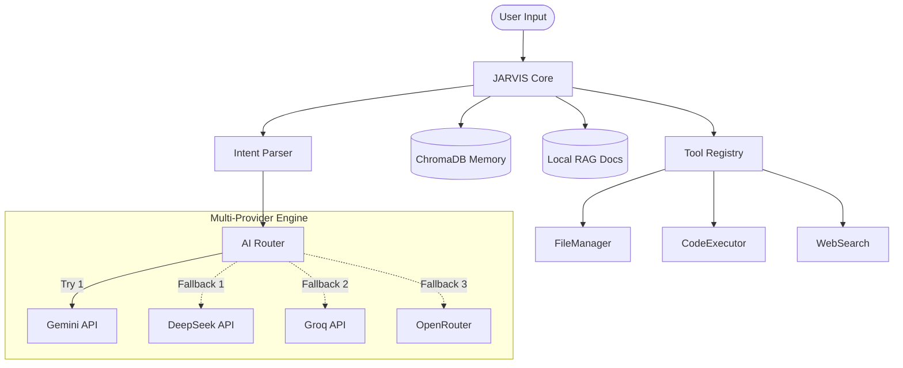

<div align="center">

# JARVIS-X — Enterprise-Grade Autonomous AI Agent

**The Ultimate Smart Life Assistant, Orchestrator, & Strategic Thinking Partner**

[](https://github.com/AzimjonKamiljanov/elite-ai-agent/actions)
[](https://www.python.org/downloads/release/python-3120/)
[](https://opensource.org/licenses/MIT)

*A fully autonomous AI Agent featuring multi-LLM orchestration, short and long-term memory via ChromaDB, RAG capabilities, intelligent tool calling, and structured cognitive load tracking.*

[Features](#features) • [Architecture](#architecture) • [Quickstart](#quickstart) • [Usage](#usage) • [Tool Extension](#tool-extension)

</div>

---

## 🎯 What is JARVIS?

JARVIS serves as a professional AI life assistant designed to act as a second brain, strategic thinking partner, and productivity optimizer.

**Core Philosophies:**
- **Zero Friction:** Always reduce mental effort for the user.
- **Actionable Output:** Focus on structured outputs and tangible steps over generic advice.
- **Resilience:** Multi-provider fallback engine guarantees an AI response even during API outages.
- **Adaptive:** Scales from simple chat to complex multi-step reasoning, coding, and scheduling tasks.

---

## ✨ Enterprise Features

- 🤖 **Multi-AI Orchestration Engine**
  - Built-in unified provider abstractions: Gemini, DeepSeek, OpenRouter, Groq, HuggingFace.
  - Automatic fallback cascading, exponential backoff retries, and circuit breakers (powered by `tenacity`).
- 🧠 **Dual Memory System & RAG**
  - Short-term conversational context coupled with long-term vector-based retrieval (ChromaDB).
  - Easily ingest local directories for RAG capability.
- 🧬 **Cognitive Intelligence Modules**
  - **CognitiveLoadBalancer:** Calculates workload based on tasks, deadlines, and break patterns.
  - **TimePerceptionEngine:** Orchestrates Pomodoro cycles and tracks deep work sessions.
  - **AntiProcrastinationEngine:** Micro-step strategies for fighting task paralysis.
- 🔧 **Extensible Tool Registry**
  - Seamlessly hook custom Python tools to the agent.
  - Built-in tools: Web Search (DuckDuckGo), File Management, Code Execution, and Terminal access.
- 🐳 **Production Ready**
  - CI/CD verified via GitHub Actions (`pytest`, `coverage`).
  - Containerized deployment ready via `Docker` and `docker-compose`.

---

## 🏗 Architecture Overview

The multi-provider architecture leverages fallback chains and intelligent routing depending on the required "Mode" (`/fast`, `/code`, `/pro`, `/study`).



---

## 🚀 Quickstart

### Option 1: Native Installation

1. **Clone the repository:**
   ```bash
   git clone https://github.com/AzimjonKamiljanov/elite-ai-agent.git
   cd elite-ai-agent
   ```

2. **Run Auto-Setup:**
   This handles venv creation, package installation, and `.env` generation.
   ```bash
   python setup.py
   ```

3. **Configure API Keys:**
   Open the newly generated `.env` file and input your keys (at least one is required).

4. **Launch JARVIS:**
   ```bash
   # Linux/macOS
   ./jarvis

   # Windows
   jarvis.bat
   ```

### Option 2: Docker Deployment

Ideal for instant containerized deployment without host-system dependencies.

```bash
# Ensure your .env file is populated, then run:
docker-compose up -d --build

# View logs
docker-compose logs -f
```

---

## 🧠 Intelligence Modes

JARVIS dynamically routes prompts based on your requested context.

| Mode | Command | Description |
|------|---------|-------------|
| **PRO** | `/pro` | Default. Detailed, research-grade, highly reasoned responses. |
| **CODE** | `/code` | Coding, refactoring, and terminal commands. |
| **FAST** | `/fast` | Quick, concise outputs (uses smaller, highly responsive models). |
| **STUDY** | `/study` | Tutoring mode based on Feynman techniques and quiz generation. |
| **FOCUS** | `/focus` | Ultra-concise, distraction-free Pomodoro session tracking. |
| **PLANNER**| `/planner`| Daily life planning, task breakdown, and cognitive load assessment. |

---

## 🛠 Tool Extension Guide

Adding new capabilities to JARVIS is straightforward thanks to the modular `ToolRegistry`.

1. **Create your tool logic** in `tools/my_tool.py`:
   ```python
   class WeatherTool:
       def get_weather(self, location: str) -> str:
           return f"The weather in {location} is 72°F and sunny."
   ```

2. **Register the tool** in `core/jarvis.py` under `_register_builtin_tools()`:
   ```python
   from tools.my_tool import WeatherTool

   weather = WeatherTool()
   self.tools.register("get_weather", weather.get_weather, "Check weather for a location")
   ```

3. **JARVIS now natively understands** it can fetch weather context during conversations!

---

## 📊 Performance & Testing

JARVIS is engineered for reliability.
- **Code Coverage**: Core orchestration logic (`core/ai_router.py`) is covered by mocked LLM integration tests (`pytest`).
- **Resilience**: The `tenacity` powered router handles rate-limits, connection drops, and API downtimes transparently.

Run the test suite manually:
```bash
python -m pytest tests/ --cov=core -v
```

---
<div align="center">
  <i>Built with precision. Designed for scale.</i>
</div>
